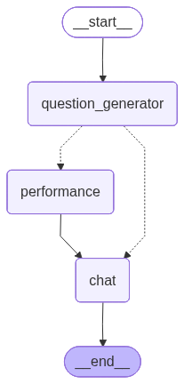
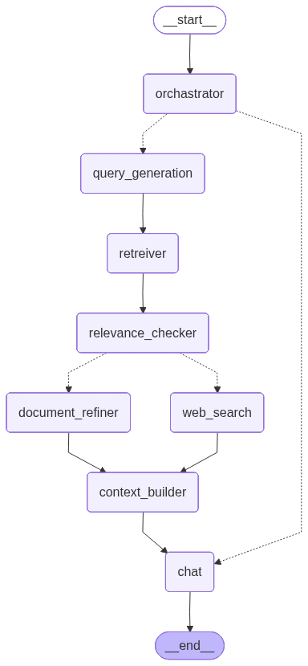

# 🎯 ML-Learner (InterviewCracker)

**The Ultimate AI-Powered Technical Interview & Machine Learning Playground.**

ML-Learner is a robust, full-stack platform designed to bridge the gap between learning and landing your dream job. It combines a sophisticated Machine Learning playground, an interactive coding environment, and AI-driven interview simulations into one seamless experience.

---

## 🚀 Core Features

### 🧠 AI Interview Simulation
- **LangGraph Driven**: Realistic technical interviews powered by LangGraph for complex, stateful conversational flows.
- **Real-time Interaction**: Server-Sent Events (SSE) for low-latency, streaming AI responses.
- **Face Tracking**: Integrated computer vision (OpenCV/MediaPipe) for engagement monitoring.
- **Performance Analytics**: Detailed feedback on technical accuracy, communication, and confidence.

### 📊 ML Playground & Trainer
- **End-to-End ML Pipeline**: Dynamic model configuration, training, and evaluation directly from the UI.
- **Visualization**: Real-time plots for classification decision regions, regression residuals, and training metrics.
- **MLflow Integration**: Track experiments and model versions seamlessly.

### 💻 Interactive Coding Practice
- **Multi-Category Challenges**: Practice Linear Algebra, Statistics, Data Structures, and ML-specific coding problems.
- **Secure Sandbox**: Python code execution environment for real-time validation.
- **Monaco Editor**: A premium, VS Code-like coding experience.

### 📝 Resume & Career Tools
- **ATS Scoring**: Match your resume against job descriptions using advanced similarity models.
- **Multi-RAG Chat**: Upload multiple documents and chat with an AI assistant to extract insights.
- **Template-Based Builder**: Create professional, high-impact resumes.

---

## 🏗️ Architecture & Tech Stack

### 🎨 Frontend (React + Vite)
- **Framework**: React 18 with TypeScript
- **Styling**: Tailwind CSS & Framer Motion
- **UI Components**: Shadcn/UI (Radix UI)
- **Visuals**: Recharts for analytics, Three.js for interactive elements
- **State/Data**: TanStack Query (React Query) & Axios
- **Editor**: Monaco Editor

### 🐍 Backend (Python)
- **Framework**: FastAPI
- **AI/LLM**: LangChain & LangGraph
- **ML Libraries**: Scikit-Learn, PyTorch, Transformers, MLflow
- **CV**: OpenCV & MediaPipe for face tracking
- **Database**: SQLAlchemy with SQLite/PostgreSQL
- **Vector DB**: ChromaDB/FAISS for RAG workflows

---

## 📊 Visualizing the AI Logic

### AI Interview State Graph
This graph represents the complex state management of our AI interview agent, built with LangGraph.


### System Component Visualization
Architecture of the underlying components and their relationships.


---

## 📁 Project Structure

```bash
ML-Learner/
├── client/                 # React + Vite application
│   ├── src/pages/          # Main application views (MLTrainer, AIInterview, etc.)
│   ├── src/services/       # API integration layers
│   └── src/components/     # Shared UI components
└── server/                 # AI & ML computation server (Python/FastAPI)
    ├── api/                # FastAPI routes and middleware
    ├── src/graphs/         # LangGraph interview flow definitions
    ├── src/components/     # ML Trainer and Code Runner logic
    └── main.py             # Server entry point
```

---

## 🚥 Getting Started

### 1. Setup Backend (Python)
```bash
cd server
# Using uv (recommended)
uv run main.py
```

### 2. Setup Frontend (React)
```bash
cd client
npm install
npm run dev
```

---

## 📄 License
This project is licensed under the MIT License - see the [LICENSE](LICENSE) file for details.

## 👨‍💻 Author
**Vansh** - [GitHub](https://github.com/VashuTheGreat)

---
_Powered by Deep Learning and Passion. 🚀_
